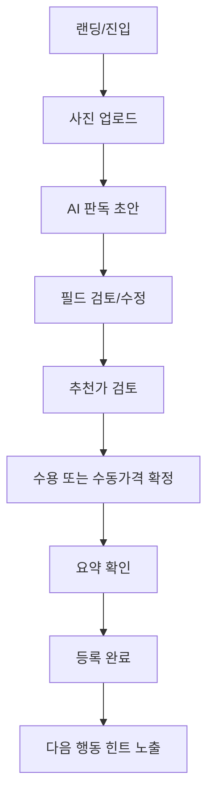
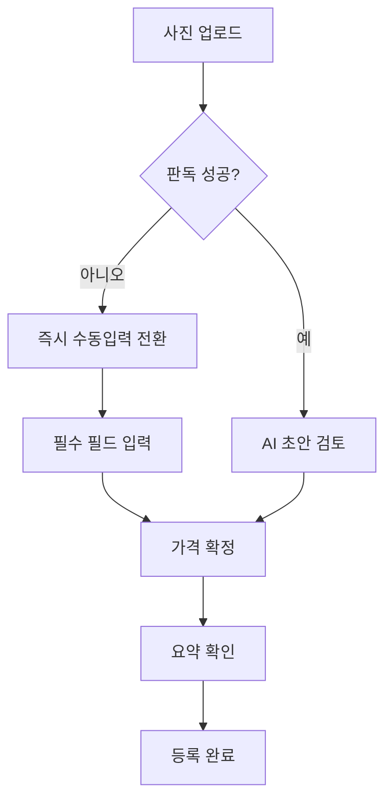
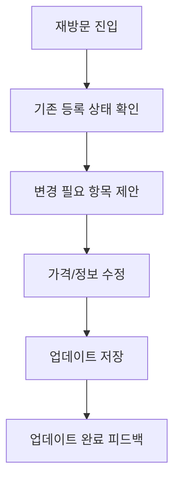

# UX Design Specification PreProduct

**Author:** 상재
**Date:** 2026-04-07T00:00:00+09:00

---

<!-- UX design content will be appended sequentially through collaborative workflow steps -->

## Executive Summary

### Project Vision

PreProduct의 리비전 UX 비전은 "팔지 말지 아직 확정하지 못한 순간"에 사용자가 1분 안에 프리리스팅을 완료하게 만드는 것이다.
이번 MVP는 의사결정 루프 고도화보다 등록 전환 검증을 우선한다.
핵심은 복잡한 판단을 강요하는 것이 아니라, 등록 완료까지의 마찰을 줄여 다음 결정을 가능하게 하는 것이다.

### Target Users

- 1차 사용자: 판매를 아직 확정하지 않은 보유자
- 2차 사용자: 등록을 빠르게 끝내고 이후 시점에 조정하려는 반복 판매자
- 공통 특성: 빠른 완료, 낮은 입력 부담, 실패 시 즉시 복구 가능한 흐름 선호

### Key Design Challenges

- 등록 시작 마찰: 판매 미확정 상태에서도 자연스럽게 시작하게 만들어야 함
- AI 신뢰 경계: AI 제안은 항상 수정 가능해야 하며, 사용자 최종 통제권이 유지되어야 함
- 실패 복원력: 판독 실패/저신뢰 상황에서도 즉시 수동 fallback으로 등록 완료가 가능해야 함
- 지표 정합성: UX 이벤트와 KPI가 실제 행동 검증에 직접 연결되어야 함

### Design Opportunities

- 1분 등록 경험: 사진 업로드 -> 판독 검토 -> 추천가 확정 -> 등록 완료까지 단순 단계 설계
- 수정 가능한 AI: "자동 제안 + 즉시 편집" 패턴으로 통제감 강화
- 복구 중심 UX: 실패 시 대체 경로를 즉시 제시해 이탈 최소화
- 학습 가능한 등록 UX: 첫 등록 이후 업데이트 행동을 유도하는 재진입 힌트 설계

## Core User Experience

### Defining Experience

PreProduct의 코어 경험은 "판매 확정 전 사용자도 1분 내 프리리스팅을 완료하는 것"이다.
핵심 가치는 복잡한 의사결정 고도화가 아니라 등록 완주율을 높이는 데 있다.
따라서 사용자에게 필요한 것은 정답 추천보다, 끊기지 않는 완료 흐름과 즉시 복구 가능한 인터랙션이다.

### Platform Strategy

- MVP 1순위 플랫폼은 모바일 웹으로 설정한다.
- 핵심 흐름은 터치 기반 단일 손 조작 맥락에서 최적화한다.
- 오프라인 지원은 이번 MVP 범위에서 제외한다.
- 카메라/사진 업로드 실패 시 재시도 또는 수동입력 fallback 전환을 1탭 내 제공한다.

### Effortless Interactions

- 사진 업로드 후 AI 초안을 즉시 제시하고, 모든 필드는 항상 수정 가능 상태로 노출한다.
- 추천가는 제안 즉시 수용 또는 수동 수정/확정이 가능해야 한다.
- 판독 실패/저신뢰 상황에서는 즉시 수동 입력 fallback으로 전환해 흐름을 유지한다.
- 등록 직전 요약에서 필수 항목만 빠르게 확인하고 완료하도록 단계를 최소화한다.

### Critical Success Moments

- 사용자가 "아직 안 팔아도 등록은 끝냈다"는 통제감을 얻는 순간
- AI 결과가 완벽하지 않아도 수정 후 완료까지 막힘 없이 이어지는 순간
- 실패 상황에서도 이탈 없이 등록 완료에 도달하는 순간
- 첫 사용자의 1분 내 등록 완료율이 기준치 이상으로 유지되는 순간

### Experience Principles

- 등록 완주가 최우선이다.
- 정상 경로와 실패 복구 경로를 하나의 코어 경험으로 설계한다.
- AI는 자동결정이 아니라 사용자 통제 강화 도구로 사용한다.
- 등록 완료/AI 검토 완료/추천가 확정 이벤트가 누락 없이 KPI 검증 흐름과 1:1로 연결되어야 한다.

## Desired Emotional Response

### Primary Emotional Goals

- 안심감: 아직 판매 확정 전이어도 지금 등록해도 된다는 감정
- 통제감: AI 제안을 사용자가 언제든 수정/확정할 수 있다는 감정
- 완료 확신: 짧은 시간 안에 끝낼 수 있다는 예측 가능성
- 복구 신뢰: 실패해도 즉시 대체 경로로 완료할 수 있다는 신뢰

### Emotional Journey Mapping

- 첫 진입: 막막함 -> "지금 바로 시작할 수 있겠다"
- 업로드/판독: 불확실성 -> "AI가 도와주지만 내가 고칠 수 있다"
- 가격 확정: 부담감 -> "추천을 참고하되 내 기준으로 확정 가능하다"
- 실패 상황: 짜증/이탈 위험 -> "바로 수동 입력으로 계속 진행할 수 있다"
- 등록 완료: 망설임 -> "아직 안 팔아도 등록은 끝냈다"
- 재방문: 단절감 -> "지난 등록 맥락 위에서 빠르게 이어갈 수 있다"

### Micro-Emotions

- Confidence over Confusion
- Control over Dependence
- Relief over Anxiety
- Momentum over Hesitation
- Trust over Skepticism

### Design Implications

- 안심감 -> 시작 화면에서 목표 시간(1분)과 최소 입력 원칙을 명확히 제시
- 통제감 -> AI 결과는 항상 편집 가능 상태로 노출, 자동 확정 금지
- 완료 확신 -> 단계 수를 고정하고 진행 상태를 상시 표시
- 복구 신뢰 -> 실패 시 1탭 내 재시도/수동 fallback 제공
- 재방문 연속성 -> 최근 등록 상태/미완료 항목을 진입 즉시 노출

### Emotional Design Principles

- 사용자의 판단을 대체하지 않고 강화한다.
- 빠른 완료와 높은 통제감을 동시에 제공한다.
- 실패는 예외가 아니라 설계 대상이며 즉시 복구 가능해야 한다.
- 모든 핵심 상태는 이해 가능한 언어로 투명하게 설명한다.

## UX Pattern Analysis & Inspiration

### Inspiring Products Analysis

- 당근:
  - 강점: 낮은 진입 장벽, 빠른 등록 시작, 모바일 친화 흐름
  - 참고점: PreProduct의 "판매 미확정 상태에서도 시작" 경험에 적합
- 번개장터:
  - 강점: 거래형 정보 구조와 신뢰 신호 노출 패턴
  - 참고점: 추천가/상태 정보 노출 방식의 신뢰 강화에 활용 가능
- 토스:
  - 강점: 복잡한 절차를 짧은 단계로 압축, 오류 복구 안내가 명확
  - 참고점: 등록 완료 전 이탈 방지와 fallback 설계에 직접 적용 가능

### Transferable UX Patterns

- Navigation Patterns:
  - 단일 핵심 태스크 중심 플로우(등록 완료) + 보조 액션 최소화
  - 단계형 진행(현재 단계/남은 단계) 가시화
- Interaction Patterns:
  - AI 제안 즉시 편집 가능 패턴
  - 실패 시 즉시 대체 경로(수동 입력) 제공 패턴
  - 최종 제출 전 요약 확인 패턴
- Visual Patterns:
  - 핵심 결정 정보(추천가, 필수 필드 상태)를 상단 우선 노출
  - 상태 배지로 완료 가능성/오류 위험을 즉시 인지 가능하게 설계

### Anti-Patterns to Avoid

- 기능 과시형 UI로 핵심 등록 경로를 가리는 구성
- AI 결과를 고정값처럼 보이게 만들어 통제감을 해치는 표현
- 실패 메시지만 노출하고 복구 액션을 늦게 제시하는 흐름
- 모바일에서 입력 단계를 과도하게 분절해 완료 리듬을 깨는 구조

### Design Inspiration Strategy

- What to Adopt:
  - 당근식 저마찰 진입
  - 토스식 단계 압축 + 명확한 오류 복구
- What to Adapt:
  - 거래앱의 신뢰 신호 패턴을 "프리리스팅 판단 보조" 맥락에 맞게 단순화
  - 추천가 UI를 "수용/수정 동등 선택" 구조로 재설계
- What to Avoid:
  - 불필요한 고급 의사결정 UI 선탑재
  - 자동화가 통제권을 가져가는 인상
- Core Rule:
  - 모든 화면은 "다음 한 단계"를 명확히 보여 등록 완료로 수렴해야 한다.

## Design System Foundation

### 1.1 Design System Choice

Themeable System 접근으로 MUI 기반 디자인 시스템을 채택한다.
MVP 목표인 빠른 구현, 일관성, 접근성 확보를 우선하며 과도한 커스텀 시스템 구축은 지양한다.

### Rationale for Selection

- Speed: 등록 전환 검증을 위한 빠른 화면 구현이 가능하다.
- Consistency: 핵심 플로우의 상태/오류/성공 표현을 일관되게 관리할 수 있다.
- Accessibility: 검증된 컴포넌트 기반으로 접근성 리스크를 낮출 수 있다.
- Flexibility: 토큰/테마 오버라이드로 브랜드 확장을 단계적으로 적용할 수 있다.

### Implementation Approach

- 기본 컴포넌트 우선:
  - Button, TextField, Select, Card, Chip, Alert, Dialog, Stepper를 우선 사용
- 도메인 커스텀 컴포넌트 최소화:
  - PhotoUploader
  - ExtractionFieldEditor
  - PriceSuggestionCard
  - ListingSummarySubmitBar
- 규칙:
  - 인라인 스타일 금지, 토큰 기반 스타일링
  - 상태 표현은 색상+텍스트+아이콘 동시 적용
  - 모바일 기준 터치 타깃 최소 44px

### Customization Strategy

- 초기 커스터마이징 범위:
  - 컬러, 타이포그래피, 간격, 반경, 그림자 토큰 중심
- 브랜드 차별화 포인트:
  - 화려한 시각 스타일보다 완료 흐름의 명확성/복구성에 집중
- 단계적 확장:
- MVP에서는 핵심 4개 도메인 컴포넌트만 커스텀
- Go 판정 이후 고급 컴포넌트 확장 검토

## 2. Core User Experience

### 2.1 Defining Experience

PreProduct의 정의 경험은 "망설이는 순간에도 1분 내 등록 완료"를 만들어내는 것이다.
사용자는 판매 확정 여부와 무관하게 등록을 시작할 수 있고, AI 보조를 활용하되 최종 통제는 스스로 유지한다.

### 2.2 User Mental Model

- 사용자는 "AI가 대신 결정"이 아니라 "AI가 정리를 도와주고 내가 확정"을 기대한다.
- 사용자는 복잡한 탐색보다 빠른 완료와 즉시 수정 가능성을 우선시한다.
- 실패가 발생해도 바로 복구할 수 있으면 제품 신뢰를 유지한다.

### 2.3 Success Criteria

- 첫 사용자 1분 내 등록 완료율이 목표 수준을 충족한다.
- AI 제안 검토 후 수정/확정 행동이 자연스럽게 이어진다.
- 실패 상황에서 fallback 전환 후 완료율 하락이 최소화된다.

### 2.4 Novel UX Patterns

- 익숙한 패턴:
  - 단계형 등록 플로우, 입력 검증, 요약 후 제출
- 차별화 패턴:
  - AI 초안 + 즉시 편집 동등 구조
  - 실패 시 1탭 fallback 전환
- 결론:
  - 친숙한 UX 80% + 복구/통제 중심 차별화 20%

### 2.5 Experience Mechanics

1) Initiation
- 사용자는 사진 업로드로 시작한다.
- 시스템은 1분 완주 목표와 최소 입력 원칙을 명확히 제시한다.

2) Interaction
- AI 초안(제목/카테고리/핵심정보/추천가)을 제시한다.
- 사용자는 즉시 수정/확정하며, 필요 시 수동 입력으로 전환한다.

3) Feedback
- 필수 항목 충족 상태와 남은 단계를 실시간으로 표시한다.
- 오류 발생 시 원인 + 즉시 복구 액션을 함께 제공한다.

4) Completion
- 요약 화면에서 핵심 값 확인 후 등록 완료한다.
- 완료 후 다음 행동(업데이트/가격조정) 힌트를 제시한다.

## Visual Design Foundation

### Color System

- 방향: 신뢰 + 명확성 + 저마찰
- Primary: 딥 블루(핵심 결정/완료 행동)
- Secondary: 뉴트럴 그레이(정보 구조/보조 요소)
- Accent: 틸/민트(진행 가능 상태, 긍정 피드백)
- Semantic:
  - Success: Green
  - Warning: Amber
  - Error: Red
  - Info: Blue
- 원칙: 상태 전달은 색상 단독 금지(아이콘/텍스트 병행)

### Typography System

- 기본 폰트: Pretendard
- Fallback: system-ui, -apple-system, Segoe UI, sans-serif
- 타입 스케일(모바일 우선):
  - H1 28/36
  - H2 22/30
  - H3 18/26
  - Body 16/24
  - Caption 14/20
- 원칙: 짧고 명령형 문장 우선, 숫자/상태 정보 가독성 우선

### Spacing & Layout Foundation

- Base unit: 8px
- 모바일: 단일 컬럼 + 하단 고정 액션
- 태블릿: 핵심 영역 1~2단 혼합
- 데스크톱: 정보 밀도 확장(비교/요약 보조 패널)
- 간격 규칙:
  - 카드 내부 16~24
  - 카드 간 12~16
  - 섹션 간 32~48

### Accessibility Considerations

- WCAG 2.1 AA 기준 준수
- 최소 터치 타깃 44x44
- 키보드 포커스 가시성 보장
- 오류 메시지는 원인 + 복구 행동 동시 제공
- 업로드/입력/저장 핵심 플로우에 스크린리더 라벨 일관 적용

## Design Direction Decision

### Design Directions Explored

- 총 6개 방향을 탐색했다.
  - D01 Command Flow
  - D02 Guided Coach
  - D03 Data Compact
  - D04 Recovery First
  - D05 Evidence Card
  - D06 Split Stage
- 시각 비교용 HTML 산출물:
  - `_bmad-output/planning-artifacts/ux-design-directions.html`

### Chosen Direction

- 메인 방향: D01 Command Flow
- 보강 요소:
  - D04의 복구 우선 구조
  - D05의 근거/수정 가능 카드 표현

### Design Rationale

- MVP 목표(등록 완주율 검증)에 가장 직접적으로 부합한다.
- 실패 상황에서 이탈을 줄이는 복구 흐름을 전면 배치할 수 있다.
- AI 제안 신뢰를 "근거 + 수정 가능"으로 설명 가능하게 만든다.

### Implementation Approach

- 등록 플로우 화면은 D01의 단계/완료 구조를 기본으로 채택한다.
- 오류/실패 상태는 D04 패턴으로 즉시 fallback CTA를 제공한다.
- 추천가/판독 결과 카드는 D05 패턴으로 근거/수정 액션을 상단 배치한다.

## User Journey Flows

### Journey 1: 정상 등록 플로우 (판매 미확정 보유자)

### Journey 2: AI 판독 실패 fallback 플로우

### Journey 3: 7일 내 업데이트 플로우

### Journey Patterns

- Navigation Patterns:
  - 업로드 -> 검토 -> 확정 -> 완료의 고정 단계 구조
  - 실패 경로는 정상 경로와 동일 목표(등록 완료)로 수렴
- Decision Patterns:
  - 추천가는 수용/수정 동등 선택
  - 필수 필드 충족 여부를 실시간으로 명시
- Feedback Patterns:
  - 단계 진행 상태 상시 노출
  - 오류 시 원인+복구 CTA 동시 노출

### Flow Optimization Principles

- 핵심 가치 도달(등록 완료)까지 단계 수를 최소화한다.
- 실패 상황의 전환 비용을 1탭 수준으로 줄인다.
- 모든 단계에서 "다음 한 단계"를 명확히 제시한다.
- 완료 이후 재방문 동기를 즉시 연결한다.

## Policy & Non-blocking Validation Checklist

### Screen-level 3-click Access Checks

- 정책·신뢰 허브 범위: 정책/신고/분쟁/개인정보 안내 하위 화면 전체를 포함한다.
- [ ] 랜딩/홈 -> 정책·신뢰 허브: 3클릭 이내 접근 가능
- [ ] 등록 플로우(업로드/검토/가격/요약) 각 단계 -> 정책·신뢰 허브: 3클릭 이내 접근 가능
- [ ] 완료 화면 -> 정책·신뢰 허브: 3클릭 이내 접근 가능

### Non-blocking Behavior Checks

- [ ] 정책/안내 표시 계층(API/콘텐츠/렌더링) 실패 시에도 등록/수정 핵심 플로우가 차단되지 않는다.
- [ ] 정책 영역 오류는 인라인 경고로 격리되며, 기본 CTA(다음/저장/완료)는 유지된다.
- [ ] 정책 데이터 재시도는 백그라운드로 동작하고 사용자의 현재 입력 상태를 손실시키지 않는다.

### E2E Regression Cases (Mandatory)

- [ ] E2E-POL-01: 등록 플로우 각 단계에서 정책 허브 3클릭 접근 검증
- [ ] E2E-POL-02: 정책 콘텐츠 로드 실패 시 비차단 등록 완료 검증
- [ ] E2E-POL-03: AI 판독 실패 후 1탭 fallback 전환 및 등록 완료 검증(회귀 고정)
- [ ] E2E-POL-04: fallback 전환 후 입력 상태 유지 및 저장 성공 검증

## Component Strategy

### Design System Components

- MUI 기본 활용:
  - Button, TextField, Select, Card, Alert, Dialog, Stepper, Snackbar
- 기본 컴포넌트로 충분한 영역:
  - 버튼 계층, 기본 폼 입력, 상태 알림, 모달, 진행 표시
- 커스텀 필요 영역:
  - AI 판독 검토 편집
  - 추천가 수용/수정 결정
  - 등록 요약 및 최종 제출

### Custom Components

### PhotoUploader
**Purpose:** 사진 업로드 시작과 상태 피드백을 단일 컴포넌트로 제공  
**Usage:** 등록 플로우 첫 단계  
**States:** idle, uploading, success, error  
**Accessibility:** 업로드 버튼/드래그 영역에 명확한 라벨 제공

### ExtractionFieldEditor
**Purpose:** AI 초안 필드를 빠르게 검토/수정  
**Usage:** 판독 결과 확인 단계  
**States:** suggested, edited, invalid, confirmed  
**Accessibility:** 필드 오류와 수정 권고를 텍스트로 명시

### PriceSuggestionCard
**Purpose:** 추천가 근거 + 수용/수정 선택 제공  
**Usage:** 가격 결정 단계  
**States:** suggested, accepted, edited, warning  
**Accessibility:** 수치 변화와 추천 근거를 읽을 수 있게 제공

### ListingSummarySubmitBar
**Purpose:** 필수 항목 충족 여부와 최종 제출 CTA 제공  
**Usage:** 요약/완료 직전 단계  
**States:** blocked, ready, submitting, done  
**Accessibility:** 비활성 사유를 명확 문장으로 노출

### Component Implementation Strategy

- 도메인 컴포넌트는 MUI 토큰을 상속해 일관성을 유지한다.
- 상태 설계는 default보다 error/recovery를 우선 설계한다.
- 모든 커스텀 컴포넌트에 키보드 포커스/스크린리더 라벨을 포함한다.

### Implementation Roadmap

- Phase 1 (핵심):
  - PhotoUploader, ExtractionFieldEditor
- Phase 2 (결정/완료):
  - PriceSuggestionCard, ListingSummarySubmitBar
- Phase 3 (고도화):
  - 재방문 업데이트 보조 컴포넌트, 실험용 변형 컴포넌트

## UX Consistency Patterns

### Button Hierarchy

- Primary: 화면의 최종 완료 행동(등록 완료) 1개
- Secondary: 보조 행동(수정/재시도)
- Tertiary: 상세 확인/보조 링크
- Destructive: 되돌리기 어려운 동작에만 사용

### Feedback Patterns

- Success: 완료 메시지 + 다음 행동 제시
- Error: 원인 + 즉시 복구 CTA
- Warning: 영향 범위 + 권장 조치
- Info: 상태/근거/가이드 문구

### Form Patterns

- 필수 입력 우선, 고급 입력은 접어서 노출
- 실시간 검증 + 제출 전 최종 검증 병행
- 오류는 필드 단위와 폼 상단 요약을 함께 제공
- AI 제안 필드는 항상 직접 편집 가능

### Navigation Patterns

- 고정 단계형 네비게이션(업로드 -> 검토 -> 가격 -> 요약)
- 모바일 하단 고정 액션 영역 유지
- 현재 단계/남은 단계 표시
- 이탈 시 재진입 복원 포인트 제공

### Additional Patterns

- Loading:
  - 스켈레톤 + 예상 대기 행동 안내
- Empty:
  - "없음" 대신 다음 액션 안내
- Recovery:
  - 실패 시 1탭 fallback 전환
- Consistency Rule:
  - 핵심 CTA 라벨/위치/순서는 전 화면에서 동일 유지

## Responsive Design & Accessibility

### Responsive Strategy

- Mobile-first를 기본 전략으로 채택한다.
- 모바일에서는 단일 컬럼 + 하단 고정 액션을 우선한다.
- 태블릿/데스크톱에서는 정보 밀도 확장(보조 패널/요약 영역)만 단계적으로 추가한다.

### Breakpoint Strategy

- Mobile: 320px - 767px
- Tablet: 768px - 1023px
- Desktop: 1024px+
- 핵심 등록 플로우는 표준 breakpoint 외에도 콘텐츠 기반 보조 분기를 허용한다.

### Accessibility Strategy

- 목표: WCAG 2.1 AA
- 기준:
  - 본문 대비 4.5:1 이상
  - 키보드 접근 가능
  - 터치 타깃 44x44 이상
  - 상태 전달 시 색상 단독 금지
  - 오류/성공/경고는 스크린리더 읽기 가능 구조로 제공

### Testing Strategy

- Responsive Testing:
  - 모바일/태블릿/데스크톱 실기기 확인
  - iOS Safari 포함 주요 브라우저 교차 검증
- Accessibility Testing:
  - 자동 검사 + 키보드 수동 검사 병행
  - VoiceOver/NVDA 핵심 플로우 점검
  - 색각 시뮬레이션 점검

### Implementation Guidelines

- 상대 단위(rem, %, vw) 우선 사용
- 모바일 우선 미디어쿼리(min-width) 사용
- Semantic HTML + ARIA 라벨 일관 적용
- 포커스 관리/오류 안내/스킵 링크를 컴포넌트 레벨에서 표준화
