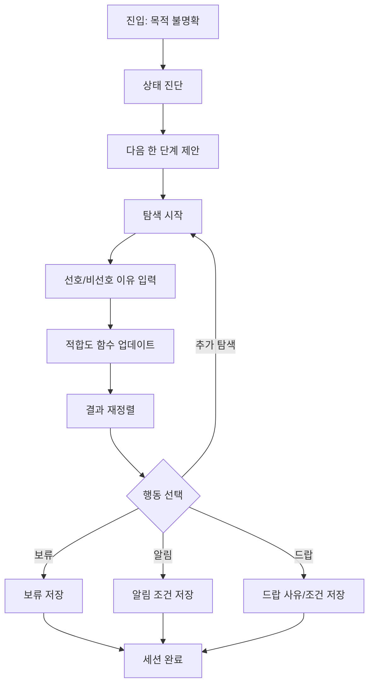
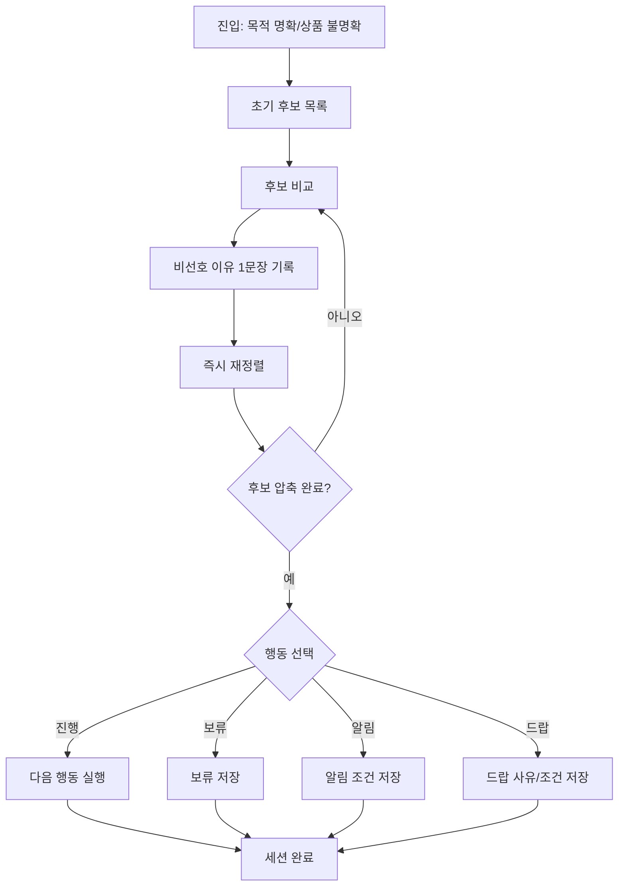
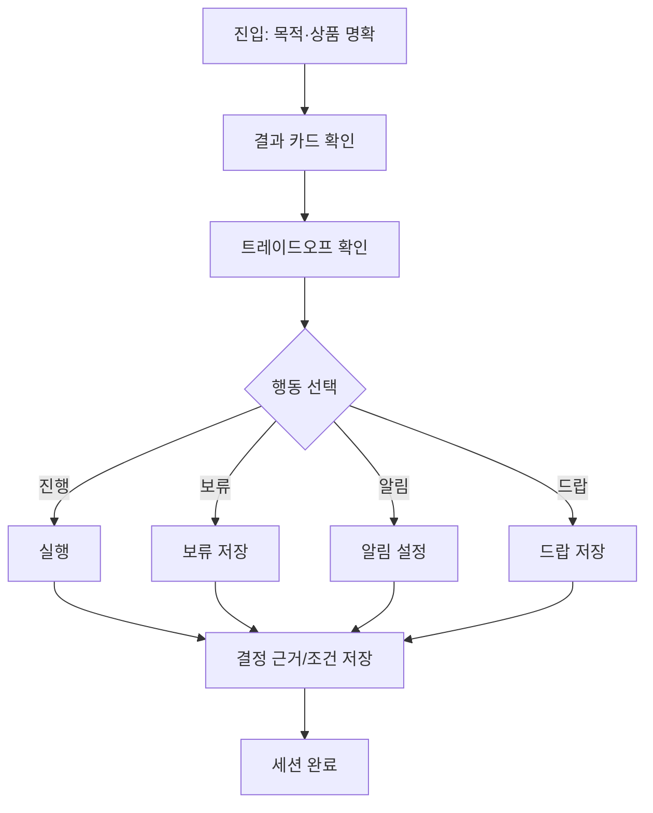

# UX Design Specification PreProduct

**Author:** 상재
**Date:** 2026-04-05T11:01:19+09:00

---

<!-- UX design content will be appended sequentially through collaborative workflow steps -->

## Scope Priority Notice (2026-04-07)

- MVP UX 구현 기준은 `Correct Course Baseline (2026-04-07 revised-minimal)`을 우선 적용한다.
- DecisionCard/FitCriteriaPanel 등 legacy 고복잡도 UX는 참고 자료이며 MVP 필수 구현 대상이 아니다.
- 2026-04-07 승인된 `Analysis Restart Baseline` 이후, 본 문서의 구현 우선순위는 검증 가설 우선으로 전환한다.
- Round 2 labeling (4/7 revised-minimal baseline):
  - Active MVP: authoritative current sprint implementation scope
  - Deferred P1.5+: design kept, implementation postponed
  - Legacy Reference: reference-only context; no implementation priority

## Executive Summary

### Project Vision

PreProduct의 UX 비전은 거래 성사 이전에 사용자의 판단 품질을 높이는 것이다.
사용자가 구매/판매/보류 결정을 내리기 전에 반드시 먼저 확인하는 판단 시작점이 되는 것이 목표다.
핵심은 정보량 자체를 늘리는 것이 아니라, 신뢰 가능한 기준과 맥락을 구조화해 복잡도를 낮추는 것이다.
PreProduct는 정보 검색 서비스가 아니라, 검색을 결정으로 끝내는 판단 서비스다.

### Target Users

- 구매 의사결정 사용자: 구매 전에 분산된 정보를 여러 채널에서 찾느라 피로를 겪는 사용자
- 자산 보유 사용자: 소유 시점부터 기회 손실(타이밍 미스)을 줄이기 위해 선제 등록 니즈가 있는 사용자
- 공통 특성: 기술 숙련도와 무관하게 낮은 복잡도, 빠른 판단 흐름을 선호

### Key Design Challenges

- 판단 기준 구조화: 사용자가 무엇을 기준으로 판단해야 하는지 즉시 이해하도록 설계해야 함
- 정보 신뢰성: 가짜/저품질 정보가 많은 환경에서 신뢰 가능한 신호를 구분해 제시해야 함
- 분산 탐색 통합: 여러 서비스 탐색을 단일 UX 흐름으로 압축해야 함
- 우선순위 설계: A(구매 전 검색) 중심의 메인 레일과 B(소유 후 선등록) 전환 레일을 충돌 없이 결합해야 함

### Design Opportunities

- 습관형 진입점 설계: "물건 살 때 일단 여기서 검색"을 만드는 첫 화면/검색 UX
- 맥락형 선등록 유도: 검색/판단 과정에서 소유 사용자에게 저마찰 선등록 CTA를 연결
- 숙련도 중립 인터페이스: 초급 사용자도 바로 이해하고 숙련 사용자도 충분한 근거를 확인 가능한 계층형 정보 구조
- 신뢰 신호 레이어: 정보별 신선도/출처/이상징후를 단순 레벨로 먼저 제시하고 상세는 펼침으로 제공
- 업데이트 데이터 활용: 보유 정보 업데이트는 개인 추천 정확도 향상에 우선 사용하고, 익명 집계된 최신성 신호만 사회적 증거로 노출
- KPI 우선순위: 북극성은 검색 후 행동 결정률, 보조는 선등록 전환률/보류 후 재전환률

## Core User Experience

### Defining Experience

PreProduct의 핵심 경험은 검색 자체가 아니라, 의도 명확도에 따라 의사결정을 수렴시키는 루프다.
사용자는 진입 시점의 상태(목적 명확도, 상품 명확도)에 따라 서로 다른 경로를 타되, 최종적으로는 선택지와 트레이드오프를 비교해 행동 결정을 내린다.

핵심 루프:
상태 파악 -> 탐색 -> 기준 학습(적합도 함수 업데이트) -> 재정렬/비교 -> 행동 선택

진입 모드:
1) 목적 불명확: 탐색 중 목적을 명확화
2) 목적 명확/상품 불명확: 탐색으로 후보를 압축
3) 목적·상품 명확: 트레이드오프 확인 후 즉시 행동 결정

목적이 명확해진 이후 행동이 드랍이어도, 해당 결정 맥락(왜 지금 안 하는지, 어떤 조건이면 재검토할지)은 폐기하지 않고 저장한다.
드랍은 이탈이 아니라 판단 완료 상태다.

### Platform Strategy

- 플랫폼 우선순위: 웹 우선 (모바일 웹 중심)
- 입력/탐색/비교/결정 흐름은 모바일 기준으로 단계 수를 최소화
- 데스크톱은 정보 밀도와 비교 가독성을 보강하는 보조 채널로 운영

### Effortless Interactions

- 현재 상태 진단: 사용자가 "지금 나는 어떤 상태인지" 즉시 파악
- 비선호 이유 표출: "왜 아닌지"를 한 문장으로 남겨 다음 탐색에 반영
- 저마찰 행동 선택: 진행/보류/알림/드랍 전환을 최소 단계로 완료
- 탐색 연속성: 보류/알림 후 재진입 시 이전 맥락을 그대로 이어받음
- 드랍 기록 자동화: 드랍 시 사유/조건/재검토 시점을 최소 입력으로 저장

### Critical Success Moments

- 목적 불명확 사용자: 다음 행동이 즉시 제안되어 막힘 없이 탐색을 시작하는 순간
- 상품 불명확 사용자: 비선호 이유가 명시되어 다음 후보 탐색이 쉬워지는 순간
- 목적·상품 명확 사용자: 트레이드오프를 확인한 뒤 적은 단계로 행동을 완료하는 순간
- 드랍 사용자: "이번엔 안 함"을 저장했지만 이후 재평가 가능하다는 확신을 얻는 순간

### Experience Principles

- 의도 상태 우선: 검색 시작 전 사용자 상태를 먼저 파악한다
- 적합도 함수 중심: 탐색의 목적은 후보 발견 + 정렬 기준 학습이다
- 기준 가시화/설명: 현재 정렬 기준과 결과 이유를 사용자에게 명시한다
- 기준 진화성: 탐색 중 입력/선호/비선호 이유로 기준을 갱신한다
- 단계 최소화: 행동 직전 플로우는 항상 짧고 명확해야 한다
- 행동 분기 명확화: 진행/보류/알림/드랍 조건을 일관 규칙으로 제시한다
- 드랍의 자산화: 드랍은 이탈이 아니라 판단 완료이며, 사유/재검토 조건/시점을 구조화해 저장한다

## Desired Emotional Response

### Primary Emotional Goals

- 명확해져감(점진적 확신): 목적이 흐릿해도 판단 기준이 점점 선명해진다는 감각
- 혼자서도 할 수 있는 통제감: 전문가/지인 상담 의존 없이 스스로 결정 가능한 상태
- 만족 가능한 판단: 완전정보가 아니어도 후회 가능성을 낮춘 충분히 좋은 선택
- 즐거운 탐색 지속성: 감당 가능한 리스크 안에서 탐색을 계속할 수 있는 긍정 감정

### Emotional Journey Mapping

- 첫 진입: 막막함 -> "어디서 시작할지 알겠다"
- 탐색/비교: 혼란 -> "왜 이게 맞고 왜 이건 아닌지 설명할 수 있다"
- 행동 선택: 압박감 -> "완벽하지 않아도 충분히 좋은 선택이다"
- 드랍/보류: 실패감 -> "지금 안 하는 결정도 자산으로 남는다"
- 재방문: 불연속감 -> "이전 판단 위에서 더 빠르게 재탐색한다"

### Micro-Emotions

- Confidence over Confusion
- Trust over Skepticism
- Curiosity over Anxiety
- Relief over Overwhelm
- Agency over Dependence

### Design Implications

- 현재 상태와 다음 한 단계 행동을 항상 명시해 막막함 제거
- 추천/정렬에 이유와 트레이드오프를 함께 제공해 상담받는 느낌 구현
- "충분 기준 충족 여부"를 명시해 완벽주의 대신 만족 가능한 판단 지원
- 리스크 수준과 가역성(되돌리기 가능성)을 보여줘 결정 불안 완화
- 모든 결과 화면은 현재 상태/다음 한 단계/가역성 정보를 함께 보여 사용자의 불안을 통제감으로 전환
- 드랍/보류를 판단 완료 상태로 저장하고 재평가 조건을 명시

### Emotional Design Principles

- 완벽한 정답보다 후회 가능성 낮은 충분 기준을 지원한다
- 목적은 탐색 중에도 점진적으로 명확해질 수 있어야 한다
- 감당 가능한 리스크 범위에서 탐색을 지속 가능하게 만든다
- 사용자에게 결정의 통제권과 복구 가능성을 명확히 제공한다
- 결정하지 않음(드랍/보류)도 가치 있는 판단으로 보존한다

## UX Pattern Analysis & Inspiration

### Inspiring Products Analysis

- 쿠팡:
  - 강점: 빠른 검색-필터-구매 전환, 즉시성 높은 정보 구조
  - 시사점: PreProduct도 판단 직전까지의 단계 수를 최소화해야 함
- 다나와:
  - 강점: 스펙/가격 비교와 정렬 기준의 명시성
  - 시사점: PreProduct의 적합도 함수(정렬 기준) 가시화에 직접 참고 가능
- 당근:
  - 강점: 지역/개인 맥락 기반의 쉬운 탐색, 낮은 진입장벽
  - 시사점: 목적 불명확 사용자도 부담 없이 시작 가능한 진입 UX 필요
- 중고나라:
  - 강점: 거래 맥락과 실사용자 기반 정보 축적
  - 시사점: 탐색 중 생성되는 판단 근거(비선호 이유, 드랍 사유)를 자산화해야 함

### Transferable UX Patterns

- Navigation Patterns:
  - 검색 + 필터 + 정렬의 즉시 반응 구조
  - 비교 가능한 카드형 결과와 빠른 재정렬 루프
- Interaction Patterns:
  - 한 번의 입력으로 다음 탐색 품질이 좋아지는 피드백
  - "왜 아닌지"를 남기면 후보군이 즉시 정리되는 상호작용
- Visual Patterns:
  - 핵심 정보 우선 노출, 상세는 펼침
  - 결과 카드 상단의 상태/신뢰/리스크 요약 배지

### Anti-Patterns to Avoid

- 필터/정렬 옵션 과다 노출로 초심자에게 과부하 유발
- 결과는 많지만 판단 이유가 보이지 않는 블랙박스 정렬
- 보류/드랍을 이탈로만 취급해 학습 데이터가 사라지는 구조
- 행동 직전 단계가 길어져 결정 피로를 키우는 플로우

### Design Inspiration Strategy

- What to Adopt:
  - 다나와식 비교/정렬 기준 명시성 -> 적합도 함수 시각화에 채택
  - 쿠팡식 짧은 전환 경로 -> 행동 선택 플로우 최소화에 채택
- What to Adapt:
  - 당근의 저마찰 진입 -> 목적 불명확 사용자용 시작 모드로 변형
  - 중고 커뮤니티의 맥락 정보 -> 익명 집계 신호 중심으로 안전하게 재구성
- What to Avoid:
  - 과도한 옵션 전면 노출
  - 근거 없는 추천/정렬
  - 드랍/보류 맥락 미저장
- 원칙 고정:
  - 모든 추천/정렬/행동 제안은 최소 1개의 사용자 기준과 1개의 근거 신호를 함께 제시

## Design System Foundation

### 1.1 Design System Choice

Themeable System 접근으로 MUI 기반 디자인 시스템을 채택한다.
초기 목표는 빠른 검증과 일관된 정보 전달이며, 과도한 커스텀 시스템 구축은 지양한다.

### Rationale for Selection

- 속도와 일관성의 균형: 검증 속도를 유지하면서도 신뢰 중심 UI를 빠르게 구현 가능
- 정보형 UX 적합성: 상태/근거/리스크 등 구조화된 판단 정보를 안정적으로 표현하기 유리
- 커스터마이징 확장성: 토큰/컴포넌트 오버라이드로 브랜드 확장 여지 확보
- 접근성/품질 기반: 검증된 컴포넌트 기반으로 초기 품질 리스크를 낮춤

### Implementation Approach

- Foundation:
  - MUI 기본 컴포넌트를 우선 채택하고, 도메인 핵심 컴포넌트만 커스텀
- Domain Components (우선순위):
  - 판단카드(Decision Card)
  - 근거 배지(Evidence Badge)
  - 리스크 배지(Risk Badge)
- Performance Rules:
  - 트리셰이킹 가능한 임포트 규칙 적용
  - 아이콘 번들 최소화
  - 핵심 화면 코드 스플릿
- Accessibility Rules:
  - 상태 정보는 색상 외 텍스트/아이콘으로 동시 전달
  - 키보드 탐색/포커스/스크린리더 라벨 기준을 도메인 컴포넌트에 적용
- Scope Guardrail:
  - 스프린트1에서는 도메인 커스텀 컴포넌트 3개(판단카드/근거배지/리스크배지)만 허용하고, 나머지는 MUI 기본 컴포넌트를 사용
- Operational Guardrails:
  - 모바일 첫 화면 3초 내 상태/다음행동/가역성 정보 노출
  - 북극성 KPI(검색 후 행동 결정률)와 화면 이벤트 1:1 매핑
  - 토큰 단일 소스 유지, 임의 인라인 스타일 금지

### Customization Strategy

- 초기 커스터마이징 강도: 중간 수준
- 토큰 우선 커스터마이징:
  - 색상, 타이포그래피, 간격, 라운드, 그림자
- 모바일 우선 조정:
  - 터치 타깃, 정보 밀도, 카드 계층 구조를 모바일 기준으로 재정의
- 경계 설정:
  - "그대로 사용" 컴포넌트와 "커스텀" 컴포넌트를 스프린트 초기에 명시
  - 차별화 포인트는 스킨보다 판단 흐름/근거 설명 구조에 집중

## 2. Core User Experience

### 2.1 Defining Experience

PreProduct의 정의 경험은 사용자의 불확실한 구매/보유 결정을, 근거가 보이는 충분히 좋은 선택으로 빠르게 정리하는 것이다.
핵심 인터랙션은 다음 루프로 정의된다:
상태 진단 -> 기준 학습(적합도 함수) -> 재정렬 -> 행동결정(진행/보류/알림/드랍)

### 2.2 User Mental Model

- 사용자는 완전한 정보보다 "후회 가능성이 낮은 선택"을 원한다.
- 사용자는 탐색 과정에서 상품 정보뿐 아니라 정렬 기준(적합도 함수) 자체를 학습한다.
- 사용자는 전문가 상담을 대체할 수준의 설명 가능성과 통제감을 기대한다.
- 드랍/보류는 실패가 아니라 이후 판단을 위한 학습 자산으로 인식되어야 한다.

### 2.3 Success Criteria

- 첫 화면 진입 후 10초 내 다음 행동(진행/보류/알림/드랍)을 이해한다.
- 탐색 중 "왜 아닌지"를 1문장으로 기록하고, 즉시 재정렬된 결과를 확인한다.
- 행동 선택 단계는 2스텝 이내로 완료한다.
- 결정 결과뿐 아니라 결정 근거와 재평가 조건이 구조화되어 저장된다.

### 2.4 Novel UX Patterns

- 패턴 전략: 익숙한 패턴 80% + 새로운 패턴 20%
- 익숙한 패턴:
  - 검색, 필터, 카드, 선택, 저장 등 일반 전자상거래/탐색 UX
- 새로운 패턴:
  - 적합도 함수 가시화(현재 정렬 기준과 변화 이유 노출)
  - 드랍 자산화(행동하지 않음의 이유/재평가 조건 저장)
- 결론:
  - 학습비용을 낮추되, 핵심 차별화는 의사결정 문법에서 만든다.

### 2.5 Experience Mechanics

1) Initiation
- 사용자는 목적/상품 명확도 상태 진단으로 시작한다.
- 시스템은 현재 상태와 다음 한 단계를 즉시 제안한다.

2) Interaction
- 사용자는 탐색/비교 중 선호/비선호 이유를 입력한다.
- 시스템은 적합도 함수를 갱신하여 결과를 재정렬한다.

3) Feedback
- 시스템은 각 결과에 기준/근거/리스크를 함께 보여준다.
- 사용자는 "왜 이 순서인지"를 이해하고 판단 자신감을 얻는다.

4) Completion
- 사용자는 진행/보류/알림/드랍 중 하나를 선택한다.
- 선택 시 결과 + 이유 + 재평가 조건이 저장되고, 다음 세션으로 연결된다.

## Visual Design Foundation

### Color System

- 방향: 신뢰 + 명확성 + 낮은 인지부하
- Primary: 깊은 블루 계열 (판단/행동의 기준축)
- Secondary: 뉴트럴 그레이 계열 (정보 밀도 관리)
- Accent: 청록/민트 계열 (긍정적 진행, 탐색의 가벼움)
- Semantic Mapping:
  - Success: 안정적 그린
  - Warning: 앰버
  - Error: 레드
  - Info: 블루
- Domain Semantic:
  - 근거 배지: 중립 블루 톤
  - 리스크 배지: 레벨별 앰버/오렌지/레드
  - 충분 기준 충족: 그린 강조
- Stage Tone Rule:
  - 탐색 단계는 활기 있는 액센트(민트)를, 결정 단계는 안정적 기준색(블루)을 우선 사용
- Contrast:
  - 본문/배경 대비는 WCAG AA 이상
  - 배지는 색상 + 아이콘/텍스트 동시 제공

### Typography System

- 톤: 전문적이지만 차갑지 않은 현대적 가독성
- Primary Typeface: Pretendard
- Fallback: system-ui, -apple-system, Segoe UI, sans-serif
- Type Scale (모바일 우선):
  - H1 28/36
  - H2 22/30
  - H3 18/26
  - Body 16/24
  - Caption 14/20
- 원칙:
  - 긴 설명보다 짧은 판단 문장 우선
  - 수치/근거/조건 텍스트는 탭ുല러 정렬 친화 스타일 유지

### Spacing & Layout Foundation

- Base unit: 8px
- 레이아웃 성격: 중간 밀도 (과밀/과공백 지양)
- 모바일:
  - 단일 컬럼
  - 판단카드 중심 스택
  - 주요 액션은 하단 접근성 영역 배치
- 데스크톱:
  - 12-column grid
  - 비교/근거 영역 병렬 배치
- 컴포넌트 간격:
  - 카드 내부 16~24
  - 카드 간 12~16
  - 섹션 간 32~48

### Accessibility Considerations

- 상태 전달은 색상 단독 금지(텍스트/아이콘 병행)
- 키보드 포커스 링 명확 표시
- 최소 터치 타깃 44px
- 에러/경고는 원인 + 복구 행동 동시 제공
- 가역성 정보(되돌리기/재평가)는 항상 가시 영역 유지

## Design Direction Decision

### Design Directions Explored

- 총 6개 방향을 HTML 쇼케이스로 탐색:
  - Direction 01: Decision Command Center
  - Direction 02: Guided Exploration
  - Direction 03: Compact Analyst View
  - Direction 04: Conversational Coach
  - Direction 05: Evidence-First Cards
  - Direction 06: Split Journey Mode
- 비교 기준:
  - 레이아웃 직관성
  - 기준/근거/리스크 정보의 가시성
  - 탐색 지속성과 결정 전환의 균형
  - 구현 안정성 및 접근성 가드레일 적합성

### Chosen Direction

- 메인 구조: Direction 01 (Decision Command Center)
- 신뢰 표현: Direction 05 (Evidence-First Cards)
- 탐색 톤: Direction 02 (Guided Exploration) 일부 차용

### Design Rationale

- 북극성 KPI(검색 후 행동 결정률)에 가장 잘 맞는 결정 중심 정보 구조
- 근거/리스크/충분 기준을 카드 상단에서 명확히 보여 신뢰 형성에 유리
- 탐색 단계에서는 민트 액센트와 가이드형 톤을 일부 적용해 재탐색 동기 유지
- MUI 기반 구현 시 안정성/속도/접근성 균형이 가장 좋음

### Implementation Approach

- 화면 전략:
  - 탐색 화면: Guided Exploration 톤(민트 액센트, 질문형 가이드)
  - 결정 화면: Decision Command Center 톤(블루 기준, 근거 중심 카드)
- 컴포넌트 적용:
  - 판단카드: D01 레이아웃 + D05 근거/리스크 배지 구조 결합
  - 배지 시스템: 충분 기준, 리스크 레벨, 근거 출처를 일관 토큰으로 렌더링
- 상호작용 원칙:
  - 행동 직전은 2스텝 이내
  - 드랍/보류는 항상 저장 가능한 판단 완료 상태로 처리

## User Journey Flows

### Journey 1: 목적 불명확 사용자 여정

- 목표: 막막함 없이 다음 한 단계로 진입
- 끊기면 안 되는 지점: 상태 진단 직후 다음 행동 제안
- 성공 완료: 목적 명확도 상승 + 행동 분기(탐색/보류/알림/드랍) 확정

이벤트 매핑:
| UX Event | PRD Canonical Event |
| --- | --- |
| `state_assessed` | `view_landing` |
| `next_step_selected` | `complete_intent_input` |
| `preference_reason_logged` | `select_action` |
| `results_reordered` | `view_decision_card` |
| `decision_context_saved` | `hold_reason_submit` |

### Journey 2: 목적 명확/상품 불명확 사용자 여정

- 목표: 후보를 빠르게 압축해 결정 가능 상태 도달
- 끊기면 안 되는 지점: "왜 아닌지" 기록 후 즉시 재정렬
- 성공 완료: 후보 1~2개로 압축 + 행동 선택(진행/보류/알림/드랍)

이벤트 매핑:
| UX Event | PRD Canonical Event |
| --- | --- |
| `candidate_compared` | `select_action` |
| `rejection_reason_logged` | `select_action` |
| `results_reordered` | `view_decision_card` |
| `decision_submitted` | `select_action` |
| `decision_context_saved` | `hold_reason_submit` |

### Journey 3: 목적·상품 명확 사용자 여정

- 목표: 최소 단계로 확신 있는 행동 완료
- 끊기면 안 되는 지점: 행동 선택 2스텝 이내 완료
- 성공 완료: 진행/보류/알림/드랍 결정 + 근거/재평가 조건 저장

이벤트 매핑:
| UX Event | PRD Canonical Event |
| --- | --- |
| `decision_card_viewed` | `view_decision_card` |
| `tradeoff_reviewed` | `select_action` |
| `decision_submitted` | `select_action` |
| `decision_context_saved` | `hold_reason_submit` |

### Journey Patterns

- Navigation Patterns:
  - 상태 -> 비교 -> 선택 3단 구조를 전 여정에서 공통 사용
  - 보류/알림/드랍은 종료가 아니라 다음 세션 연결 상태로 관리
- Decision Patterns:
  - "왜 아닌지" 입력은 탐색 품질 개선의 필수 신호
  - 모든 행동은 이유/조건 저장을 동반
- Feedback Patterns:
  - 결과 카드에서 기준/근거/리스크를 동시 노출
  - 다음 한 단계 행동을 항상 상단/가시 영역에 유지

### Flow Optimization Principles

- 단계 최소화: 행동 직전 플로우는 2스텝 이내
- 즉시 반영: 사용자 입력은 다음 결과 정렬에 즉시 반영
- 저장 우선: 결정 결과뿐 아니라 맥락 데이터를 구조화 저장
- 연속성 보장: 재방문 시 이전 맥락을 불러와 탐색 재개 비용 최소화

## Component Strategy

### Design System Components

- MUI 기본 컴포넌트 활용:
  - Button, IconButton, Chip, Card, List, Tabs, Dialog, Snackbar, TextField, Select, Drawer
- 기본 제공으로 충분한 영역:
  - 버튼 계층, 폼 입력, 기본 모달/오버레이, 알림/피드백, 기본 네비게이션
- 커스텀이 필요한 갭:
  - 적합도 함수 가시화
  - 판단 근거와 리스크를 동시 표현하는 도메인 카드
  - 행동결정(진행/보류/알림/드랍) 전용 액션 패턴

### Custom Components

#### DecisionCard

**Purpose:** 판단 결과를 기준/근거/리스크와 함께 제시해 행동 결정을 돕는다.  
**Usage:** 결과 목록과 상세 비교 화면의 핵심 단위 컴포넌트.  
**Anatomy:** 제목, 충분 기준 상태, 근거 요약, 리스크 레벨, 가역성, 액션 트리거.  
**States:** default, hover, selected, loading, error, disabled.  
**Variants:** compact(목록), expanded(비교/상세).  
**Accessibility:** 상태 텍스트/아이콘 병행, 키보드 포커스 순서 보장, ARIA label 제공.  
**Interaction Behavior:** 카드 선택 시 근거 상세 펼침, 액션바와 연동.

#### FitCriteriaPanel

**Purpose:** 현재 적합도 기준(정렬 기준)과 우선순위 변화를 사용자에게 가시화한다.  
**Usage:** 탐색/비교 화면 상단 또는 고정 패널.  
**Anatomy:** 기준 항목, 가중치/우선순위, 최근 변화 이유, 리셋/조정 액션.  
**States:** default, updating, changed, reset, unavailable.  
**Variants:** mobile-collapsed, desktop-expanded.  
**Accessibility:** 슬라이더/토글에 명확한 라벨, 값 변화 시 스크린리더 안내.  
**Interaction Behavior:** 기준 변경 시 즉시 재정렬 이벤트 발생.

#### ActionDecisionBar

**Purpose:** 진행/보류/알림/드랍 행동을 저마찰로 결정하게 한다.  
**Usage:** 판단카드 하단 고정 액션 영역.  
**Anatomy:** 4개 주요 액션, 현재 추천 액션 강조, 보조 설명(근거 요약/가역성).  
**Action Mapping:** `진행`은 FR7의 `구매/판매`, `보류`는 `보류`, `알림/드랍`은 `대안`으로 해석한다.  
**States:** enabled, disabled, submitting, completed.  
**Variants:** sticky-mobile, inline-desktop.  
**Accessibility:** 버튼 역할/순서 명확화, 최소 터치 타깃 44px.  
**Interaction Behavior:** 선택 시 이유/조건 저장 모달 또는 즉시 실행.

**Guardrail:** ActionDecisionBar는 근거 요약과 가역성 정보 없이 단독 노출하지 않는다.

### Component Implementation Strategy

- 스프린트1 핵심 3개:
  1) DecisionCard
  2) FitCriteriaPanel
  3) ActionDecisionBar
- EvidenceBadge/RiskBadge는 DecisionCard 내부 서브파트로 통합 구현
- 구현 순서:
  1) DecisionCard
  2) FitCriteriaPanel
  3) ActionDecisionBar
- 공통 원칙:
  - MUI 토큰 기반 구현
  - 상태/근거/리스크의 텍스트+아이콘 동시 전달
  - 이벤트 로깅 포인트를 컴포넌트 단에 명시

### Implementation Roadmap

- Phase 1 (Core):
  - DecisionCard, FitCriteriaPanel, ActionDecisionBar
  - Journey 1/2/3 핵심 플로우에 우선 적용
- Phase 2 (Supporting):
  - DropSaveModal, RevisitConditionEditor
  - 보류/드랍 맥락 저장 UX 강화
- Phase 3 (Enhancement):
  - 고급 비교 뷰, 개인화 기준 템플릿, 실험 변형 컴포넌트
  - KPI/실험 결과 기반 미세 조정

## UX Consistency Patterns

### Button Hierarchy

- Primary Button:
  - 사용처: 한 화면의 최종 행동(예: 진행 확정)
  - 규칙: 화면당 1개 원칙, 고대비 색상(블루), 명확한 동사 사용
- Secondary Button:
  - 사용처: 보조 행동(보류, 알림 설정)
  - 규칙: 시각 강조는 낮추되 접근성 대비 유지
- Tertiary/Text Button:
  - 사용처: 저위험 보조 동작(상세 보기, 편집)
- Destructive Button:
  - 사용처: 되돌리기 어려운 동작에 한정
  - 규칙: 확인 단계 필수
- Decision Action Rule:
  - 진행/보류/알림/드랍 4액션은 동일 순서/동일 라벨 체계를 유지
  - ActionDecisionBar는 근거 요약 + 가역성 정보 없이 단독 노출 금지

### Feedback Patterns

- Success:
  - 즉시 성공 메시지 + 다음 가능한 행동 제시
- Error:
  - 원인 + 복구 방법 + 재시도 CTA 동시 제공
- Warning:
  - 리스크 수준(낮음/중간/높음)과 영향 범위를 함께 표시
- Info:
  - 추천/정렬 결과는 최소 1개 사용자 기준 + 1개 근거 신호 포함
- Persistence:
  - 보류/드랍 저장 성공은 재진입 시 재노출 가능해야 함

### Form Patterns

- 입력 최소화:
  - 기본 입력은 단계별 점진 공개
- Validation:
  - 실시간 검증 + 제출 시 요약 검증 병행
- Reason Capture:
  - "왜 아닌지" 입력은 1문장 기본 패턴 제공
- Save Semantics:
  - 드랍/보류 입력 시 사유/재평가 조건/시점을 구조화 저장
- Accessibility:
  - 필드 라벨/오류 메시지/힌트 텍스트를 명확히 연결

### Navigation Patterns

- Core Structure:
  - 상태 진단 -> 비교 -> 선택의 3단 구조를 전 여정 공통 적용
- Mobile First:
  - 단일 컬럼 + 하단 액션 영역 우선
- Progress Visibility:
  - 현재 상태와 다음 한 단계는 항상 상단 가시 영역 유지
- Return Flow:
  - 보류/알림/드랍 이후 재진입 시 이전 맥락 복원

### Additional Patterns

- Search & Filter:
  - 필터 과다 노출 금지, 핵심 필터 우선 노출 + 고급 필터 접기
- Reorder Pattern:
  - 기준 변경 시 결과 즉시 재정렬 + 변경 이유 표시
  - 기준 변경 인터랙션은 1초 내 시각 피드백(정렬 갱신 또는 로딩 상태) 제공
- Empty State:
  - "결과 없음" 대신 다음 탐색 행동(조건 완화, 기준 변경) 제시
- Loading State:
  - 스켈레톤 + 예상 대기 행동 안내
- Consistency Rule:
  - 탐색 단계는 민트 톤, 결정 단계는 블루 톤 우선 사용

## Responsive Design & Accessibility

### Responsive Strategy

- Mobile-first 전략을 기본으로 설계한다.
- Desktop:
  - 비교/근거 병렬 배치와 정보 밀도 확장을 허용한다.
- Tablet:
  - 단일 컬럼 기반에서 일부 2단 블록(카드 + 보조패널)을 허용한다.
- Mobile:
  - 상태/다음행동/가역성 우선 노출, 하단 액션 영역 고정 우선.

### Breakpoint Strategy

- Mobile: 320px - 767px
- Tablet: 768px - 1023px
- Desktop: 1024px+
- 구현 방식:
  - 표준 브레이크포인트 사용 + 핵심 화면은 콘텐츠 기준 추가 분기 허용
  - 미디어쿼리는 모바일 기준(min-width)으로 확장

### Accessibility Strategy

- 목표 준수 수준: WCAG 2.1 AA
- 핵심 요구:
  - 본문 대비 4.5:1 이상
  - 상태 전달은 색상 단독 금지(텍스트/아이콘 병행)
  - 키보드 전용 내비게이션 보장
  - 최소 터치 타깃 44x44px
  - 포커스 인디케이터, ARIA 라벨, 라이브 영역 알림 적용

### Testing Strategy

- Responsive Testing:
  - 실제 모바일/태블릿/데스크톱 디바이스 검증
  - Chrome/Edge/Safari 우선 브라우저 교차 확인
- Accessibility Testing:
  - 자동화 검사 + 수동 키보드 점검 병행
  - 스크린리더(VoiceOver/NVDA) 핵심 여정 점검
  - 색각 이상 시뮬레이션 점검
- Journey Validation:
  - Journey 1/2/3의 끊김 금지 지점 회귀 테스트

### Implementation Guidelines

- 상대 단위(rem, %) 우선 사용, 고정 px 남용 금지
- 토큰 단일 소스 유지, 임의 인라인 스타일 금지
- 반응형 이미지/자산 최적화
- 상태 변화는 시각+텍스트+보조기술 안내를 동시에 제공
- 컴포넌트 개발 시 접근성 체크리스트를 PR 단위로 강제

## Round 2 Label Harmonization (2026-04-07)

### Active MVP

- In this document, Active MVP means the authoritative implementation scope for the current sprint.

### Deferred P1.5+

- In this document, Deferred P1.5+ means design is retained, but implementation is postponed.

### Legacy Reference

- Existing extended or historical narratives are treated as Legacy Reference.
- If any conflict exists, Active MVP and Deferred P1.5+ take precedence.

## Correct Course Baseline (2026-04-07 revised-minimal)

### UX Scope Override (MVP)

- 본 절은 MVP 범위에서 기존 복잡 플로우보다 우선한다.
- UX 목표를 "복합 판단 탐색"에서 "등록 전환 + AI 보조 효용 검증"으로 재정의한다.
- 근거 문서: `_bmad-output/planning-artifacts/sprint-change-proposal-2026-04-07-needs-work.md`

### Simplified Core Flow

1. 사진 촬영/업로드
2. AI 자동 판독 결과 확인/수정
3. AI 추천가 확인/수정
4. 자동 가격조정 옵션 on/off + 규칙 선택
5. 등록 완료

### Primary Screens (MVP)

- ListingCreatePage
- AIExtractionReviewPage
- PricingSuggestionPage
- AutoAdjustRulePage
- ListingCompletePage

### Component Priority (MVP)

- Required:
  - `PhotoUploader`
  - `ExtractionFieldEditor`
  - `PriceSuggestionCard`
  - `AutoAdjustRuleSelector`
  - `ListingSummarySubmitBar`
- Deferred:
  - 고급 DecisionCard/FitCriteriaPanel 중심 비교 UX
  - 보류/재평가 고도 루프 시각화

### UX Quality Gates (MVP)

- 태스크 테스트 기준 등록 완료율 `>= 70%`
- AI 제안 수용률 `>= 50%`
- 필수 필드 판독 정확도 `>= 85%`
- 자동 가격조정 실패율 `< 1%`
- 판독 실패 시 수동입력 fallback 완료율 `100%`

### Interaction Rules (MVP)

- 한 화면 1개 핵심 결정만 요구한다.
- AI 제안은 항상 "수정 가능" 상태로 노출한다.
- 실패/불확실 상황에서 즉시 수동 입력 대안을 제공한다.
- 등록 직전 요약 화면에서 가격/규칙/핵심 필드 최종 확인을 강제한다.

## Analysis Restart Baseline (2026-04-07 approved)

- 승인 문서: `_bmad-output/planning-artifacts/sprint-change-proposal-2026-04-07-analysis-restart.md`
- 상태 전환:
  - UX 명세를 "구현 가이드"에서 "검증 가설/평가 계획" 중심으로 우선 전환한다.
- 우선 작업:
  - 핵심 가설별 사용자 검증 시나리오 재정의
  - 태스크 성공 기준과 관측 이벤트 재정렬
  - 구현 컴포넌트 우선순위보다 검증 우선순위를 먼저 확정
- 재개 규칙:
  - 분석 재시작 선행 단계 및 `[IR]` 승인 전에는 개발 착수 기준으로 사용하지 않는다.

